# Overwatch Scala Game (GUI)
This GUI application is a turn-based battle game inspired by the game “Overwatch" from Blizzard Entertainment. The game is a two-player battle game where each player picks a character called Heroes from one of the three roles to defeat their opponent. The roles are Tank, Damage, and Support. Each role gives the hero a unique passive trait. Besides that, each hero has a unique set of abilities which can carried out different behaviours such as attack, heal, or boost agility.  

The game was developed using Scala and object-oriented programming concepts.

# Features
**Home Screen**
 
 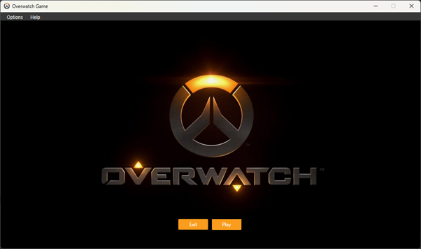
  
	When the application starts, the home screen is displayed. The player can click “Play” to start the game or “Exit” to close the application.
  
  
**Hero Roles**
 
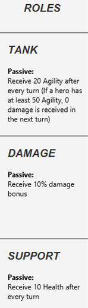
 
Every character in the game belongs to a one of the three roles which are Tank, Damage, and Support. Each role has a unique passive skill. For example, Tank heroes will receive additional 20 agility points after every turn. If a hero gains at least 50 agility points, they will receive 0 damage on their next turn. Secondly, Damage heroes will receive additional 10% damage bonus when inflicting damage on their opponent. Lastly, Support heroes will receive additional 10 health points after every turn.
 
 
**Hero Selection**
 
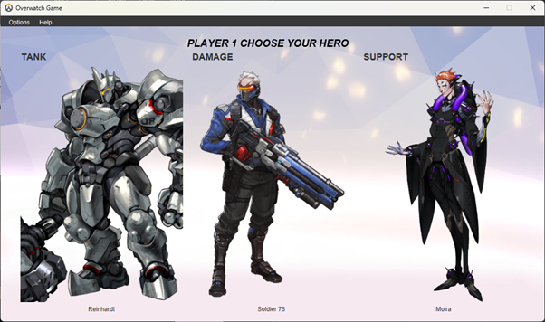
 
Each player in the game must pick a hero by clicking on the hero’s image. Once a hero is selected, the player will start the game with that selected hero. 
 
 
**Hero Abilities**
 
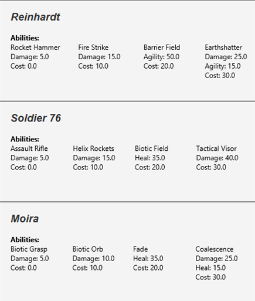
 
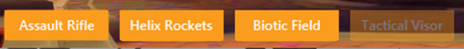
 
Every hero in the game has a unique set of 4 abilities. Every ability can have a mixture of traits which are attack, heal or add agility. Additionally, every ability has a cost which will be deducted from the hero’s stamina once the ability is used. An ability cannot be used if the hero’s stamina does not meet the ability’s cost requirement. This is visualised in the GUI shown below where the ability buttons will be disabled based on the hero’s stamina.
 
 
**Turn-based Battle System**
 
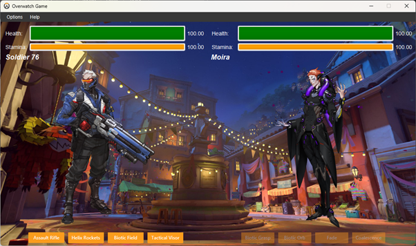
 
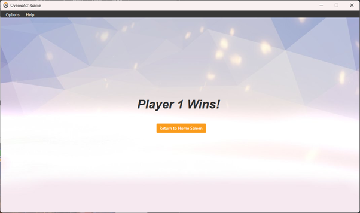
 
Once both players have chosen their respective heroes, the game screen is displayed and the game begins starting with player 1’s turn. On a player’s turn, they must choose to use an ability by clicking on one of the four buttons below their hero’s character image. Once an ability is used, the other player’s turn begins. Once both players have used an ability, both players will gain 10 stamina points. The game will end when either player’s health reaches 0 which will then display the game over screen. The game over screen will display the winning player and the user can click the “Return to Home Screen” button to return to the home screen.
 
 
**Dynamic GUI Elements**
  
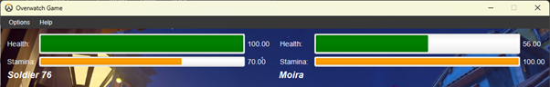
 
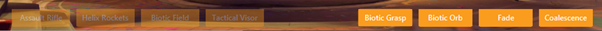
 
Another feature of the application is the health and stamina bar. The bars will change according to the hero’s health and stamina values. Besides that, the ability buttons will be disabled and enabled according to the player’s turn. This ensures that only the correct player can use an ability easily.
 
 
**Dialog Box**
 
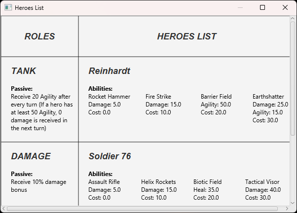
 
In the application’s menu bar, the user can access the heroes list dialog box to find more information about the heroes and their roles in the game. This feature is especially useful for the player to strategize their next move in the game.
 
 
**Fade Animation**
 
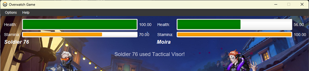
Once an ability is used, a text that displays the ability that was by the player will appear and disappear after 2.5 seconds. This animation will inform the player which ability was used and can act as a confirmation message for the ability.
  
  
**Accessibilty Buttons**
 
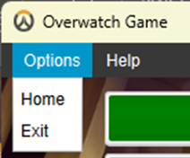
 
In the application’s menu bar, the user also has access to two option buttons which are “Home” and “Exit”. These buttons will allow the user to return to the home screen or exit the application respectively. The “Home” button is especially useful if the user wants to restart the game or change their hero character.

